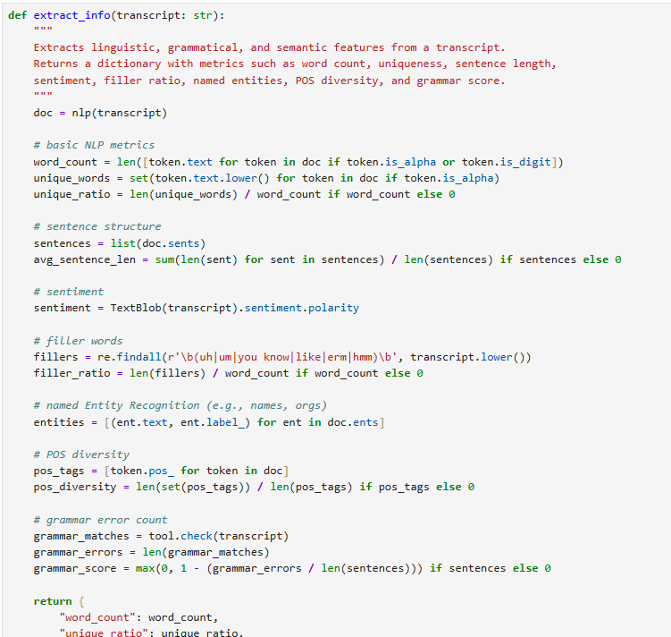
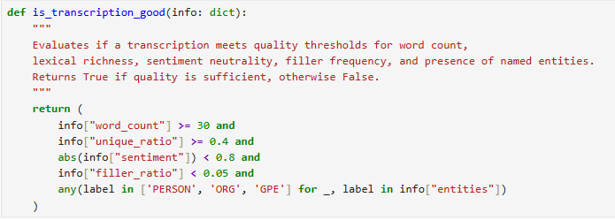
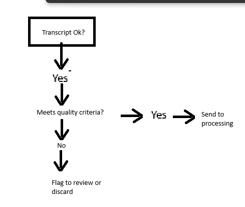
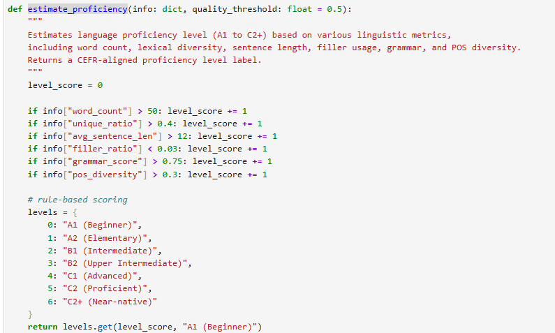
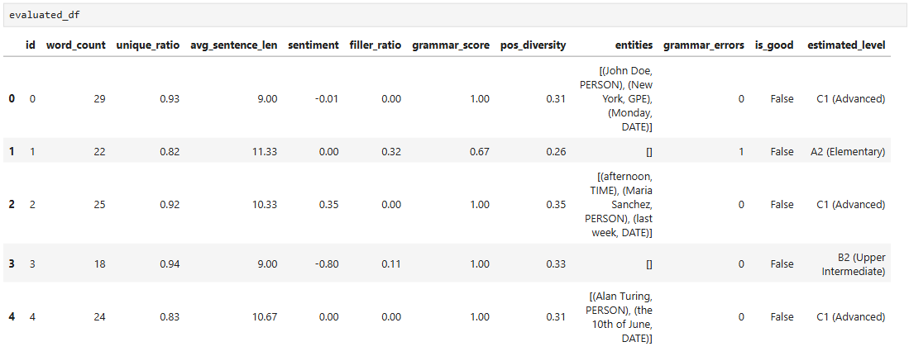

# Voice Call Transcription Analyzer

## Introduction 👋
To demonstrate my problem-solving approach and technical skills, I created a voice call transcription analyzer that extracts meaningful information from transcribed calls, evaluates whether the data is suitable for further processing, and estimates the speaker's English proficiency level.  

My aim was not only to answer the questions provided but also to build something practical and showcase real implementations using Python, NLP libraries, and scoring logic.  
Feel free to explore the logic, code and implementation. (Notebooks->Analyzer.pynb)

## Questions & Answers
### 1. How to extract information from voice call transcriptions?
Voice call transcriptions are unstructured data, and to extract structured information from them, we need a solid Natural Language Processing (NLP) pipeline. Here's a breakdown of methods, tools, and approaches I recommend and used in my project:  
🔧 Preprocessing Tools & Techniques:

| Category       | Methods & Technologies      | Purpose                                  |
|----------------|-----------------------------|------------------------------------------|
| Preprocessing  | spaCy, NLTK, regex          | Tokenize, segment, clean                 |
| Text Features  | TextBlob, spaCy             | Count words/sentences, extract sentiment |
| NER            | spaCy                       | Find people, organizations, locations    |
| POS Tagging    | spaCy                       | Analyze grammatical richness             |
| Filler Detection | regex (uh, um, ah, etc.)  | Measure fluency, reduce noise            |
| Grammar Check  | language_tool_python        | Detect grammar errors                    |

These methods help create a structured feature set from unstructured transcripts — essential for analysis, scoring, and automation.
Here is how I have implemented this:  

### 2. How to define if a voice call transcription is "good" for further processing?
A “good” transcription is one that meets minimum quality thresholds across key features. All thresholds should be fitted for a different case, adapted and checked. Here's how I assess that:

And this is how we could represent the problem as decision tree visualization. (diagram)
  

### 3. How to measure English proficiency level from transcripts?
To estimate English proficiency, I extract linguistic complexity, vocabulary richness, and grammar accuracy from transcriptions.  
Features to measure:  

| Feature       | Insights Provided      | 
|----------------|-----------------------------|
| Word Count  | Fluency and idea development        |
| Unique Word Ratio  | Vocabulary richness             | 
| Sentence Length            | 	Syntactic complexity                     | 
| POS Diversity   | 	Overall language correctness                      | 
| Filler Word Ratio  | Fluency, hesitation levels        | 
| Grammar Check  | 	Overall language correctness        | 

My implementation:  

## Code & Notebook
I've created a Jupyter Notebook that:
* Loads and cleans transcripts
* Extracts the described features
* Checks if transcript is good for preprocessing
* Classifies proficiency levels  
Final result:

# Final Note 
Thank you for considering my application. I enjoyed diving into this NLP-focused task and showing my initiative to go beyond just answering — I built a working prototype.

If you're looking for someone who blends analytical thinking, practical coding skills, and creativity, I’d love the chance to work together.  

Thank you for concideration of my employment. Hope you enjoyed my answer :)
